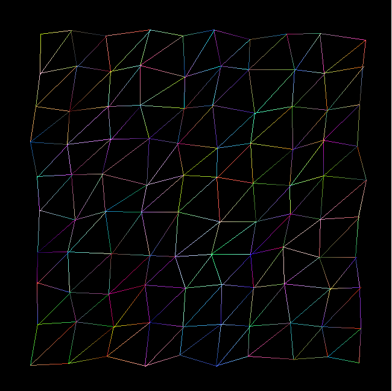
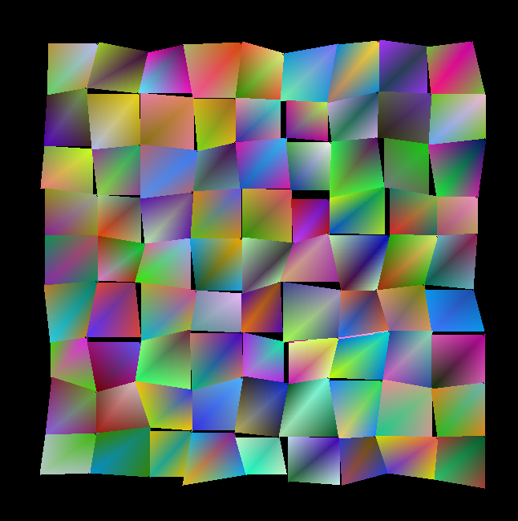
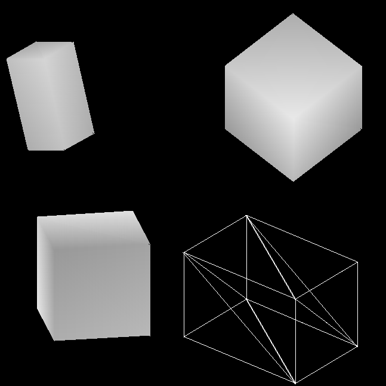
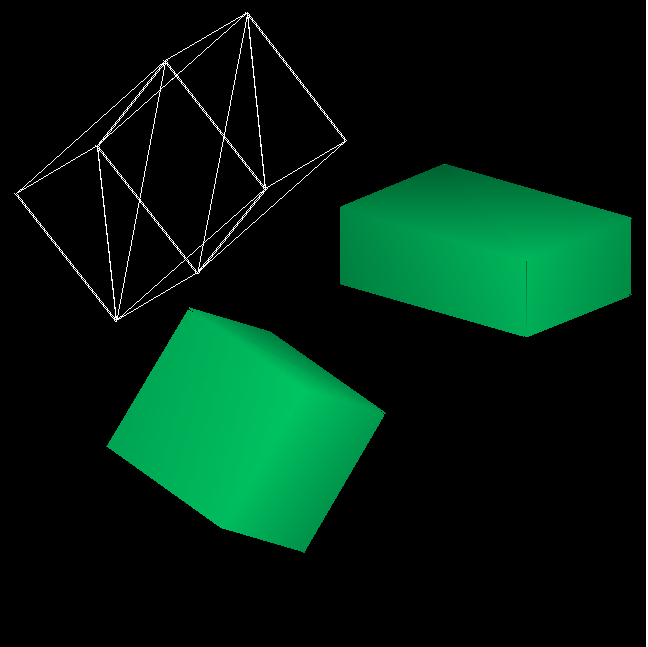

# 3D Object Renderer
This program uses **qt** libraries to generate 3D objects on screen qithout using the openGL library. Objects are described by a custom language (samples can be found in the Custom_language_samples directory).

All rendering algorithms are located in the LineDrawer.cpp

This program can only be built with gcc compiler (Linux environment recommended).

## Screenshots:

